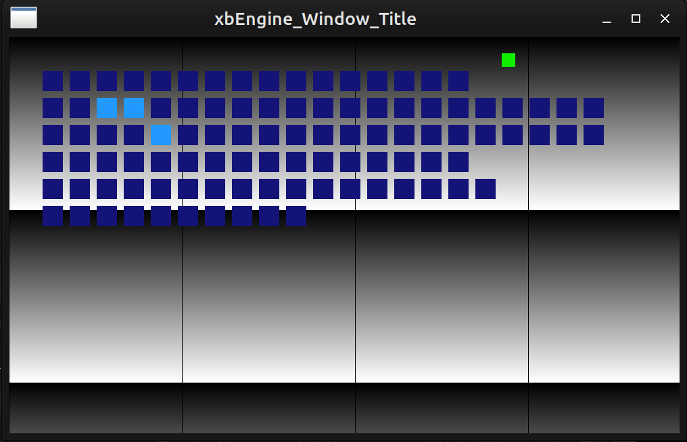

# Overview

This project is a platform layer for cross platform applications or games. <br>
The code interfaces with the OS using [SDL2](https://wiki.libsdl.org/SDL2/FrontPage). <br>
It is a work in progress, still I hope it can be useful as a reference for anyone trying to create an engine themselves. <br>




# Features and Usage
Running the application opens a window with a scrollable background (up/E, down/D), an audio output (sine wave) with variable frequency controlled by the mouse position and a visualization for keyboard input. <br>
All platform dependent code is in the `sdl_xbEngine.cpp` file. This file also contains the entrypoint into the code. It calls into the application/game code, which is platform independent. <br>
<br>
There is a good amount of debugging output when running the application from the terminal. More can be enabled or disabled by setting flags in the `constants.h` file. <br>
To extend the application, call into your own code from the main loop in `sdl_xbEngine.cpp` or extend my code in `xbEngine.cpp`. <br>


# How to Build
The project calls into SDL2 and requires the library to be available on the user's system. It can be compiled manually or the distribution's package can be used. [Installing SDL2](https://wiki.libsdl.org/SDL2/Installation) <br>
<br>
Or on ubuntu based systems: <br>

```
sudo apt update
sudo apt install libsdl2-dev
```

In either case, adjust the relevant section of the Makefile to link against the library on your system. <br>
<br>
C++ build tools can be installed on Ubuntu based systems with: <br>

```
sudo apt update
sudo apt install build-essential
```

<br>
I use g++ on Linux Mint 21 using a Makefile to build. <br>
To build using the Makefile: <br>
<br>

```
cd src
make
```

<br>
Or directly with g++: <br>
<br>

```
cd src
g++ -c -o ../build/obj/sdl_xbEngine.o sdl_xbEngine.cpp -g -Wall -Werror -DXB_SLOW=1 -D_REENTRANT -I/usr/include/SDL2 -lSDL2
g++ -c -o ../build/obj/xbEngine.o xbEngine.cpp -g -Wall -Werror -DXB_SLOW=1 -D_REENTRANT -I/usr/include/SDL2 -lSDL2
g++ -o ../build/xbEngine ../build/obj/sdl_xbEngine.o ../build/obj/xbEngine.o -g -Wall -Werror -DXB_SLOW=1 -D_REENTRANT -I/usr/include/SDL2 -lSDL2
```

<br>

To run: <br>

```
../build/xbEngine
```

<br>
